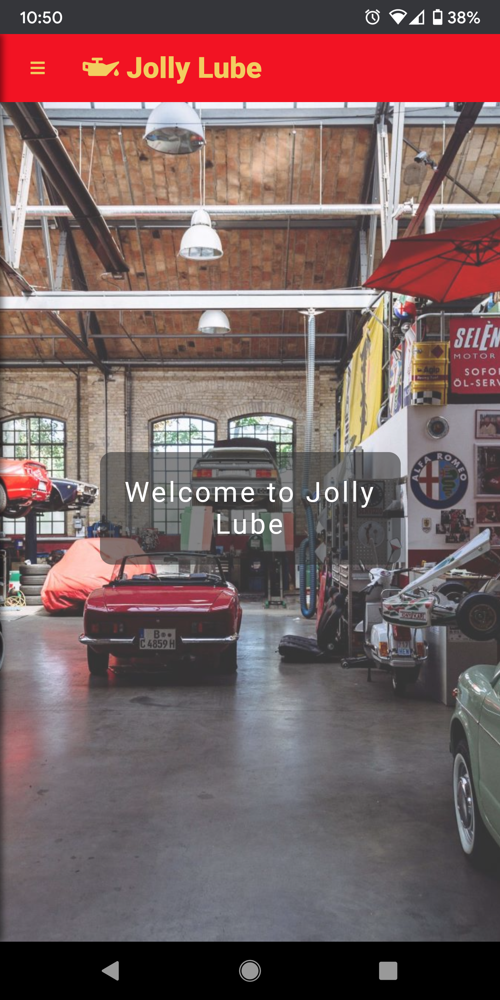
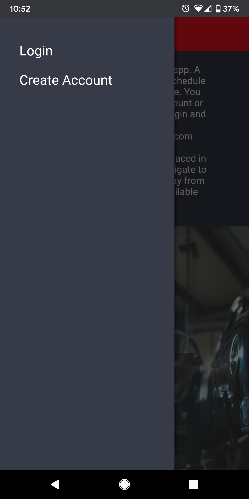
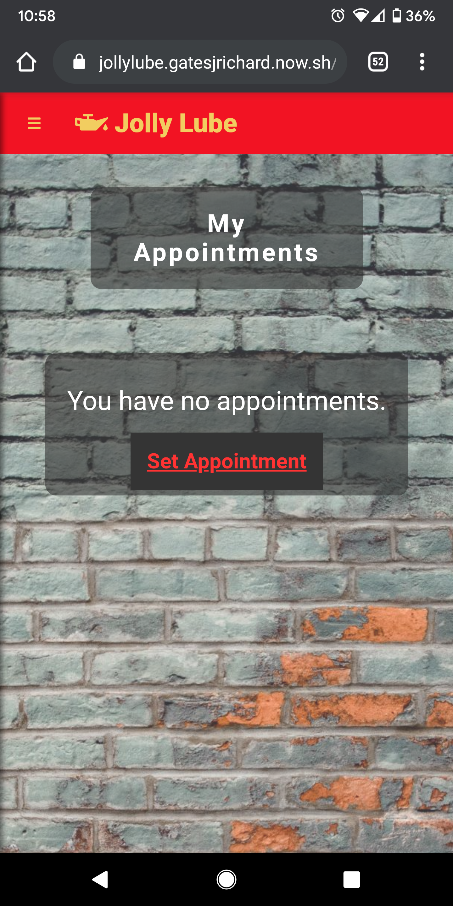
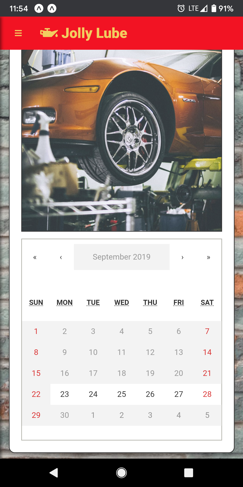
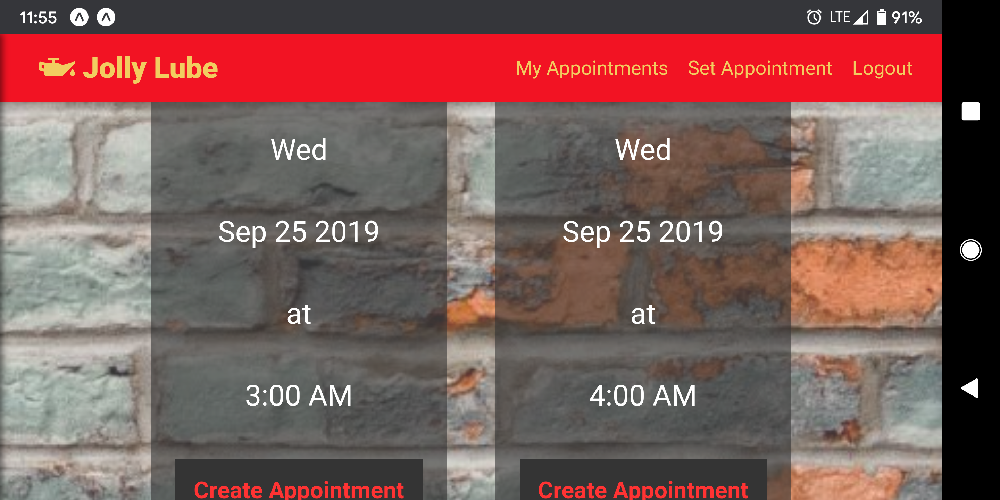

# Jolly Lube

https://www.https://jollylube.gatesjrichard.now.sh/

## About

Jolly Lube is the first full-stack app that I coded 100% by myself. (I did have the amazing TA's and Mentor at Thinkful to help me work through issues) It is a booker app, where users can schedule appointments to bring their cars in for service. The pictures are a bit much for such a type of business, and the fact that you can schedule as many appointments as you like is a bit unrealistic but fun.

## How to use the site

### Website

Jolly Lube is deployed using Zeit, at https://www.https://jollylube.gatesjrichard.now.sh/

### Home/Landing Page

### Navigation

On wider screen devices, the navigation buttons are located in the upper right. For smaller screen devices, access them via the slide-out drawer, hamburger menu on the upper left corner.

Once logged in these buttons will change from "Login", and "Create Account" to "My Appointments", "Set Appointment" and "Logout"

You can always get back to the home page by clicking the logo in the upper left.

### Create Account
You will find a "Create Account" link in the navbar. 

### Login
Or you can use the test credentials (someone@example.com passw8rD#) to log in.

### My Appointments

Once logged in, you will be taken to the "/myappointments" page, and a list of any appointments will be displayed, or a link to schedule an appointment if you don't have any yet.

On this page, you will also be able to cancel any appointments using the cancel button on the individual appointment.

### Set Appointment

When you navigate to set appointment (/setappointment), you will see a calendar with available days and days that are not available to select (gray background).

Selecting a day will generate a list of available appointment times you can select from.

Now  you are all set to have your car serviced at Jolly Lube! Home of the Jolly Fast Oil Change! or is that Jiffy Fast?

## Technology Used

FrontEnd client: React, deployed on Zeit
Backend Server: Node, Express, deployed on Heroku
Database: PostSQL, Heroku addon to Backend server

## What did I learn from this project

There is a giant leap from going through lessons or tutorials meant to teach you to create a specific site, to imagining and creating your project. A big challenge for me was the user authorization, having only learned about it the week before I started this project. Also, I had never styled a website this fully before, but I wanted to make it look as nice as possible. During the styling, I followed a couple of tutorials on youtube. First, for the hamburger, slide-out drawer (https://www.youtube.com/watch?v=l6nmysZKHFU). Second, parallax for the homepage images (https://www.youtube.com/watch?v=JttTcnidSdQ). Also, a bit of a struggle was dealing with times, and figuring out how to interact with npm-react-calendar. It was several hours of reading documentation and trial and error to figure out what I could and could not do. I wish I could have figured out how to style the calendar part of the app a little more, especially the backgrounds for active and inactive days.

## What things would I add to make this site even better?

Right now the site is not yet fully functioning, there is no way for the shop owner to know what if any appointments or who set those appointments. Also, it would be nice if users could receive email or text message reminders for the appointments they have created.

1) Add more email support.
    a) send an email to a user to confirm their account
    b) send email reminders about appointments
2) A way for the user to reset their password
3) Admin account
    a) admin can add and remove appointment times
    b) admin can click on the calendar and see appointments that are set for that day